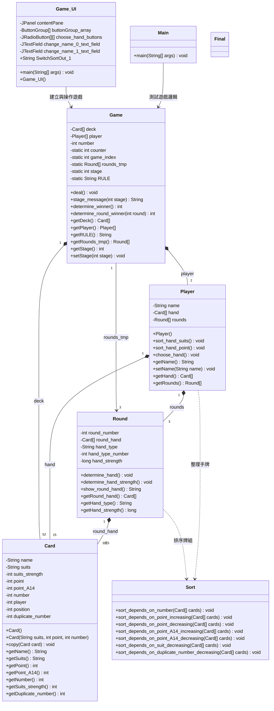
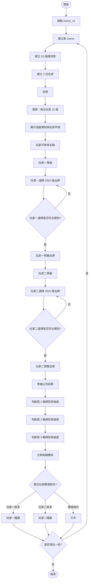

# UML 圖與遊戲流程圖

## Java 程式碼 UML 圖

```mermaid
classDiagram
    class Game_UI {
        -JPanel contentPane
        -ButtonGroup[] buttonGroup_array
        -JRadioButton[][] choose_hand_buttons
        -JTextField change_name_0_text_field
        -JTextField change_name_1_text_field
        +String SwitchSortOut_1
        +main(String[] args) void
        +Game_UI()
    }

    class Game {
        -Card[] deck
        -Player[] player
        -int number
        -static int counter
        -static int game_index
        -static Round[] rounds_tmp
        -static int stage
        -static String RULE
        +deal() void
        +stage_message(int stage) String
        +determine_winner() int
        +determine_round_winner(int round) int
        +getDeck() Card[]
        +getPlayer() Player[]
        +getRULE() String
        +getRounds_tmp() Round[]
        +getStage() int
        +setStage(int stage) void
    }

    class Player {
        -String name
        -Card[] hand
        -Round[] rounds
        +Player()
        +sort_hand_suits() void
        +sort_hand_point() void
        +choose_hand() void
        +getName() String
        +setName(String name) void
        +getHand() Card[]
        +getRounds() Round[]
    }

    class Round {
        -int round_number
        -Card[] round_hand
        -String hand_type
        -int hand_type_number
        -long hand_strength
        +determine_hand() void
        +determine_hand_strength() void
        +show_round_hand() String
        +getRound_hand() Card[]
        +getHand_type() String
        +getHand_strength() long
    }

    class Card {
        -String name
        -String suits
        -int suits_strength
        -int point
        -int point_A14
        -int number
        -int player
        -int position
        -int duplicate_number
        +Card()
        +Card(String suits, int point, int number)
        +copy(Card card) void
        +getName() String
        +getSuits() String
        +getPoint() int
        +getPoint_A14() int
        +getNumber() int
        +getSuits_strength() int
        +getDuplicate_number() int
    }

    class Sort {
        +sort_depends_on_number(Card[] cards) void
        +sort_depends_on_point_increasing(Card[] cards) void
        +sort_depends_on_point_decreasing(Card[] cards) void
        +sort_depends_on_point_A14_increasing(Card[] cards) void
        +sort_depends_on_point_A14_decreasing(Card[] cards) void
        +sort_depends_on_suit_decreasing(Card[] cards) void
        +sort_depends_on_duplicate_number_decreasing(Card[] cards) void
    }

    class Main {
        +main(String[] args) void
    }

    class Final

    Game_UI --> Game : 建立與操作遊戲
    Main --> Game : 測試遊戲邏輯
    Game "1" *-- "52" Card : deck
    Game "1" *-- "2" Player : player
    Game "1" --> "3" Round : rounds_tmp
    Player "1" *-- "15" Card : hand
    Player "1" *-- "3" Round : rounds
    Round "1" *-- "3或5" Card : round_hand
    Round ..> Sort : 排序牌組
    Player ..> Sort : 整理手牌
```

## 遊戲流程圖

```mermaid
flowchart TD
    A([開始]) --> B[啟動 Game_UI]
    B --> C[建立新 Game]
    C --> D[建立 52 張撲克牌]
    D --> E[建立 2 位玩家]
    E --> F[洗牌]
    F --> G[發牌：每位玩家 15 張]
    G --> H[顯示遊戲規則與玩家手牌]
    H --> I[玩家可修改名稱]
    I --> J[玩家一準備]
    J --> K[玩家一選擇 3/5/5 張出牌]
    K --> L{玩家一選牌是否符合規則?}
    L -- 否 --> K
    L -- 是 --> M[玩家一預覽出牌]
    M --> N[玩家二準備]
    N --> O[玩家二選擇 3/5/5 張出牌]
    O --> P{玩家二選牌是否符合規則?}
    P -- 否 --> O
    P -- 是 --> Q[玩家二預覽出牌]
    Q --> R[準備公布結果]
    R --> S[判斷第 1 輪牌型與強度]
    S --> T[判斷第 2 輪牌型與強度]
    T --> U[判斷第 3 輪牌型與強度]
    U --> V[比較每輪勝負]
    V --> W{哪位玩家勝場較多?}
    W -- 玩家一較多 --> X[玩家一獲勝]
    W -- 玩家二較多 --> Y[玩家二獲勝]
    W -- 勝場相同 --> Z[平手]
    X --> AA{是否再玩一局?}
    Y --> AA
    Z --> AA
    AA -- 是 --> C
    AA -- 否 --> AB([結束])
```
